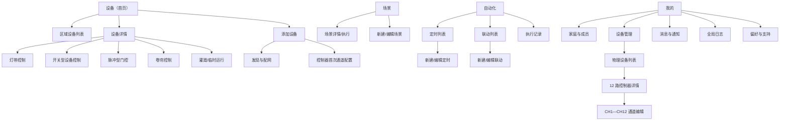
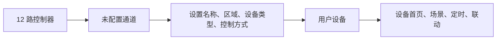

# 庭院 IoT App 产品需求文档

> 版本：v0.2（交互原型基线）  
> 日期：2026-08-03  
> 当前范围：仅 App 软件产品与交互设计，不讨论硬件选型、电气参数、接线和固件实现。

## 1. 产品定义

一款面向全球私人庭院业主和设备安装商的移动端 App，用一套一致的操作方式管理庭院灯光、庭院门、水泵、喷泉、电磁阀、车库门、卷帘及其他接入设备。

产品核心价值：

1. 把控制器的技术通道转化为用户看得懂的庭院设备。
2. 让日常控制在首页即可完成，减少进入设备详情页的次数。
3. 通过场景、定时和设备联动完成庭院氛围与设备协同。
4. 对门、车库门、水泵等敏感设备提供准确、可追溯的操作反馈。

## 2. 产品目标与非目标

### 2.1 本阶段目标

- 管理一个或多个庭院，以及庭院内的区域和设备。
- 支持 Wi-Fi、蓝牙设备的添加、查看、控制和状态反馈。
- 完整设计智能灯带的日常控制、灯效和 DIY 能力。
- 完整设计多路干接点控制器在 App 中的通道配置与设备化控制。
- 明确区分场景、定时、联动和设备临时控制。
- 为业主与安装商提供共用功能，并通过家庭权限控制可操作范围。
- 支持全球化所需的语言、时区、日期格式和单位适配。

### 2.2 暂不纳入本阶段

- 干接点电气规格、负载能力、接线图及防护等级。
- 灯带灯珠类型、功率、分段数量及通信协议细节。
- 固件升级协议、云端架构、量产测试工具。
- 电商、社区内容、AI 灯效生成、订阅付费。
- 能耗分析，除非后续设备能力明确支持能耗采集。

## 3. 用户与使用场景

### 3.1 庭院业主

主要诉求：

- 快速知道庭院设备是否正常。
- 一键控制常用灯光、喷泉、水泵、门和卷帘。
- 保存聚会、晚餐、迎宾、离家等庭院场景。
- 设置每天、工作日、日出日落相关的定时任务。
- 建立简单可靠的设备联动，并能查明“为什么执行或没有执行”。

### 3.2 设备安装商

主要诉求：

- 在业主授权下进入同一庭院完成设备添加和通道配置。
- 给技术通道设置名称、类型、控制方式和安全规则。
- 测试单个设备、场景和自动化。
- 查看设备在线状态、操作记录和故障信息。

安装商不使用独立 App；业主通过成员邀请和临时访问权限控制其进入范围和有效期。

## 4. 核心产品原则

1. **设备优先**：打开 App 首先看到庭院设备，而不是内容、商城或复杂仪表盘。
2. **用户设备优先于技术通道**：普通用户看到“喷泉”“车库门”，而不是“控制器 CH1”。
3. **能力驱动界面**：App 根据设备上报的能力显示控制项；不支持的能力不置灰展示，直接隐藏。
4. **状态必须诚实**：没有反馈输入时，只显示“指令已发送”，不能推断为“门已打开”。
5. **危险操作提高确认成本**：开门、开车库门、启动高风险设备可配置长按、二次确认或身份验证。
6. **自动化可解释**：联动必须用自然语言摘要、执行记录和失败原因说明运行结果。
7. **基础功能保持克制**：设备控制、场景和自动化不混入社区、商城或 AI 内容。

## 5. 核心概念与术语

| 概念 | 定义 | 典型示例 |
|---|---|---|
| 家庭/庭院 | 权限、设备和自动化的最高业务容器 | 上海住宅、度假屋 |
| 区域 | 庭院内的空间分组 | 前院、后院、露台、泳池区 |
| 控制器 | 被 App 管理的物理设备 | 12 路干接点控制器 |
| 通道 | 控制器内可配置的技术输出 | CH1、CH2 |
| 用户设备 | 通道配置完成后呈现给用户的对象 | 喷泉、庭院门、水泵 |
| 设备组 | 同类设备的同步控制集合 | 露台灯带组、全部庭院灯 |
| 灯效 | 单个灯或灯组的颜色动画配方 | 极光、篝火、自定义流动 |
| 场景 | 用户手动一键执行的多设备动作集合 | 花园晚宴、全部关闭 |
| 定时 | 由时间或日出日落触发的计划 | 每天日落后 15 分钟开灯 |
| 联动 | 由设备事件触发、可附带条件的自动规则 | 门打开后，路径灯亮 5 分钟 |
| 临时控制 | 从设备详情发起的一次性倒计时或限时运行 | 喷泉运行 30 分钟 |

关键命名规则：灯光内部的预设统一称为“灯效”；跨设备的一键操作统一称为“场景”。

设备对象规则：智能灯带和 12 路控制器属于“物理设备”；控制器中已配置的每一路属于“用户设备/逻辑设备”。物理控制器负责安装、联网与排障，逻辑设备负责日常控制、场景与自动化。

## 6. 信息架构

### 6.1 底部导航

| 一级导航 | 主要内容 | 核心任务 |
|---|---|---|
| 设备 | 庭院切换、区域筛选、收藏、设备卡片、状态摘要 | 查看和快速控制 |
| 场景 | 常用场景、全部场景、执行记录 | 一键执行多设备动作 |
| 自动化 | 定时、联动两个子页 | 创建和管理自动规则 |
| 我的 | 家庭成员、设备管理、通知、日志、偏好与支持 | 管理与排障 |

“首页”和“设备”合并：设备页即 App 首页，避免同一批设备在两个入口重复展示。

### 6.2 页面地图

## 7. 全局体验设计

### 7.1 庭院与区域

- 顶部显示当前庭院，点击可切换其他庭院。
- 设备按区域筛选，默认展示“全部”。
- 未分配区域的设备进入“未分区”。
- 收藏设备位于全部设备之前；同一设备仍保留所属区域信息。
- 首版使用列表/卡片视图，不加入庭院平面地图。

### 7.2 设备状态规范

| 状态 | 页面表现 | 允许操作 |
|---|---|---|
| 在线且空闲 | 显示设备真实状态和可用控制 | 全部允许 |
| 指令发送中 | 操作区显示执行中，避免重复提交 | 可取消的操作允许取消 |
| 指令成功 | 短反馈；有状态回传时刷新状态 | 继续操作 |
| 指令失败 | 保留原状态，给出原因和重试 | 重试/查看详情 |
| 离线 | 显示最后在线时间，弱化控制 | 不允许实时控制；允许查看设置和日志 |
| 部分离线 | 场景或设备组显示成功/失败数量 | 可重试失败对象 |
| 权限不足 | 说明所需权限 | 不展示伪可用按钮 |
| 未知状态 | 明确显示“状态未知” | 依安全规则决定是否允许发送指令 |

### 7.3 指令反馈规则

- 乐观反馈只用于低风险且状态可快速确认的灯光、普通开关。
- 门、车库门等敏感设备优先等待状态反馈。
- 没有反馈能力的脉冲通道，成功文案为“指令已发送”。
- 8 秒内没有收到执行确认时显示“设备未确认，请检查现场状态”。具体超时值后续由技术方案确认。
- 所有远程操作记录操作者、来源、时间、目标、结果和失败原因。

## 8. 智能灯带功能需求

### 8.1 设备卡片

显示：名称、区域、在线状态、开关状态、当前颜色或灯效、亮度。

快捷操作：

- 点击开关：开/关灯。
- 点击卡片主体：进入详情。
- 收藏后置顶。
- 首版不在卡片中直接展示完整色盘，避免首页操作过密。

### 8.2 灯带详情页

固定控制区：

- 开关。
- 亮度滑杆。
- 当前模式/灯效名称。
- 在线、蓝牙近场或云端连接状态。

模式区根据能力动态显示：

1. **白光**：色温滑杆、常用色温预设、亮度。
2. **颜色**：色轮、饱和度、亮度、最近使用、收藏色、数值输入；取色板属于增强能力。
3. **灯效**：分类、预览、应用、收藏、速度、暂停/继续；不支持速度的灯效隐藏速度项。
4. **DIY**：颜色列表、运动方式、速度、方向、循环、亮度、分段配置、测试和保存。
5. **音乐**：声源、灵敏度、效果和预览；仅能力支持时显示。

快捷入口：临时定时、加入场景、创建定时、创建联动、设备日志、设置。

### 8.3 灯效库

首版分类建议：自然、节日、氛围、动态、我的收藏、我的 DIY。

首版内置动态方式：渐变、流动、跳变、呼吸、闪烁、波浪、随机。

灯效卡片包含名称、预览缩略、适用设备能力、收藏状态。点击先预览，确认后应用；预览退出时可恢复此前状态。

### 8.4 分段控制

当设备能力支持分段时：

- 展示灯带分段示意和当前选中范围。
- 支持单段、多段、全选、连续范围选择。
- 支持将颜色或灯效复制到其他分段。
- 保存 DIY 前检查是否有未配置分段。

不支持分段时，整个分段入口隐藏。

### 8.5 灯光设备组

- 只允许能力兼容的灯光建立同步控制组。
- 组内支持开关、亮度、公共颜色和公共灯效。
- 某项能力不是全组共有时不展示该项。
- 设备组解决“同步控制同类灯”，场景解决“跨类型设备一起执行”，两者不合并。

## 9. 多路干接点控制器 App 功能需求

### 9.1 软件对象转换

- “我的—设备管理”只列物理设备，保留“控制器—通道”关系，方便安装和排障。
- 通道配置完成后，在普通设备列表呈现为独立用户设备。
- 未配置通道默认不进入普通设备列表。
- 删除用户设备配置不会自动删除控制器；重置需明确确认影响范围。
- 用户设备详情展示来源关系，例如“DC12 控制器 · CH1”，并提供“编辑通道”和“查看控制器”入口。
- 同一路通道只能对应一个用户设备；修改名称、类型或区域后，首页和关联详情同步更新。

### 9.2 入口与控制器详情

存在两个通道配置入口：

1. 首次添加：设备首页“添加设备” → 选择“12 路控制器” → 完成配网 → 进入首次通道配置。
2. 后续维护：“我的” → “设备管理” → “12 路控制器” → 选择 CH1—CH12。

控制器详情必须展示：

- 控制器名称、型号、在线状态和连接方式。
- 已配置、未配置和异常通道数量。
- CH1—CH12 完整列表，包含通道编号、配置状态、用户设备名称、类型、区域和控制方式摘要。
- 控制器设置入口；恢复出厂、移除设备等破坏性操作必须与通道清空分开确认。
- 首次配置模式可提示“现在配置常用通道，也可稍后在设备管理中继续”，不强迫一次配置完 12 路。

### 9.3 通道配置

字段：

- 通道名称：必填；保存后作为首页用户设备名称。
- 所属区域：必选；允许选择“未分区”。
- 设备类型和图标：庭院门、喷泉、灌溉、水泵、车库门、卷帘或自定义。
- 控制方式：保持型“开关”或“点动/脉冲”。
- 脉冲时长：仅点动/脉冲模式显示；实际可选范围由设备能力决定。
- 接点极性：常开（NO）或常闭（NC）；仅在设备能力支持时显示。
- 首页显示：关闭后不出现在设备首页，但仍保留在控制器详情中。
- 敏感操作：开启后，首页和详情的控制动作都执行二次确认等安全规则。
- 场景与自动化：关闭后，该通道不出现在场景、定时和联动的动作选择器中；已有规则需提示影响并停用相关动作。
- 运行超时提醒：适用于水泵、喷泉、灌溉等持续运行设备；支持关闭或选择预设时长。

设备类型模板：水泵、喷泉、电磁阀、灌溉区、庭院门、车库门、卷帘、遮阳篷、普通设备、自定义。

保存规则：

- 未配置通道保存有效名称和类型后转为“已配置”，并按“首页显示”规则生成用户设备。
- 已配置通道允许修改上述字段，修改结果同步影响设备首页和关联详情。
- “清除通道配置”只清除此路的用户设备映射，不删除物理控制器；执行前提示关联场景、定时和联动的影响。
- 通道配置是 App 侧逻辑映射；涉及固件写入或继电器参数时必须展示发送中、成功或失败状态。

### 9.4 控制方式

| 控制模型 | 页面主控 | 适用设备 | 软件反馈 |
|---|---|---|---|
| 保持型开关 | 开/关 | 水泵、喷泉、普通负载 | 有反馈显示真实状态；无反馈显示最后指令状态并标注未确认 |
| 脉冲动作 | 单次动作按钮 | 门控、触发器 | 显示“指令已发送”，不虚构最终状态 |
| 开/停/关 | 三动作控制 | 卷帘、遮阳篷 | 支持开、停、关；有位置反馈时显示百分比 |
| 限时运行 | 启动时长、剩余时间、暂停/停止 | 灌溉、电磁阀、喷泉 | 展示本次运行状态和结束时间 |

### 9.5 保持型设备详情

- 主开关和状态。
- 本次已运行时长。
- 临时运行：选择 5/15/30/60 分钟或自定义，结束后自动关闭。
- 倒计时关闭。
- 相关场景、定时、联动。
- 操作记录与设备设置。

### 9.6 脉冲型门控详情

- 主按钮使用动作文案，如“打开庭院门”或“触发”。
- 敏感动作可配置长按、二次确认或生物识别。
- 有反馈输入时显示开启、关闭、开启中、关闭中、受阻、状态未知。
- 无反馈输入时仅显示最近一次指令及发送结果。
- 可配置长时间未关闭提醒、夜间开启提醒和操作通知。
- 首页允许直接执行门控等敏感动作，但必须沿用该设备配置的长按、二次确认或身份验证规则。
- 首版不提供“批量开门”。

### 9.7 卷帘/遮阳篷详情

- 将相关通道组合为一个用户设备。
- 提供开、停、关三个明确动作。
- 支持时显示当前位置和目标位置。
- 自动化中允许开、停、关；百分比位置仅在能力明确支持时出现。

### 9.8 灌溉/电磁阀详情

- 立即运行支持“持续运行”和“限时运行”两种方式，不强制选择时长。
- 持续运行需要明确提示“将持续运行，直到手动停止”，并支持运行超时提醒。
- 展示剩余时间、预计结束时间、暂停和停止。
- 展示今日运行记录和下一条定时。
- 多个区域存在互斥限制时，由能力和规则约束动作选择；首版不设计硬件并发策略。

## 10. 场景

### 10.1 定义

场景是用户主动触发的一组动作，可包含灯效、设备控制、限时运行、延迟和通知。场景本身没有触发条件。

### 10.2 场景列表

- 收藏场景置顶。
- 场景卡显示名称、图标、设备数量和最近执行结果。
- 点击卡片执行；进入详情需使用明确的更多入口，避免误操作。
- 执行中显示整体进度；结束后显示成功、部分成功或失败。

### 10.3 新建/编辑场景

步骤：

1. 名称、图标、是否收藏。
2. 添加设备或灯组。
3. 为每个对象设置动作。
4. 调整步骤顺序和延迟。
5. 测试场景。
6. 保存。

执行规则：

- 同一步内动作并行执行，不同步骤按顺序执行。
- 延迟是独立步骤，不能让用户误认为前一个设备仍在执行。
- 部分失败时继续执行不依赖失败设备的后续步骤。
- 结果页列出每个对象的结果，并允许只重试失败项。
- 开门等敏感动作默认不建议加入普通场景；若开放，保存和执行都需风险确认。

## 11. 自动化

### 11.1 自动化信息架构

自动化页内部固定分为两个子页：

- **定时**：由时间计划触发。
- **联动**：由设备事件触发，并可附加条件。

临时倒计时和限时运行留在设备详情，不进入自动化列表。

### 11.2 定时

时间类型：

- 指定时间。
- 指定日期。
- 每日或每周重复。
- 日出/日落及前后偏移。

配置字段：名称、时间、重复日、生效日期范围、时区、执行动作、失败通知、启用状态。

动作可直接控制一个或多个设备，也可执行已有场景。创建完成前必须支持“测试本次动作”。

时区规则：

- 定时绑定庭院所在时区，不跟随操作者旅行位置变化。
- 修改庭院时区时，明确提示现有定时将如何调整。
- 夏令时切换时按当地墙上时间执行，并在日志中记录实际时间与时区。

### 11.3 联动模型

统一使用“当—并且—就”表达：

#### 当：触发事件

首版支持：

- 设备开启、关闭或状态变化。
- 门开启、关闭、受阻等设备事件。
- 设备开始或停止运行。
- 设备在线或离线。
- 某状态持续指定时长。
- 某个场景被手动执行。

必须区分：

- **事件**：“庭院门打开了”，只在变化瞬间触发。
- **状态**：“庭院门保持打开”，需要持续时长后触发。

#### 并且：约束条件

首版支持：

- 生效时间段。
- 星期。
- 日出/日落相关时段。
- 其他设备当前状态。
- 家庭模式，如在家、离家、度假；模式的具体来源后续确认。

首版逻辑规则：多个触发条件采用“任一满足（OR）”，多个约束条件采用“全部满足（AND）”，暂不支持嵌套逻辑组。

#### 就：动作

首版支持：

- 控制设备。
- 应用灯光颜色、亮度或灯效。
- 执行场景。
- 启动限时运行或停止设备。
- 延迟。
- 发送通知。

### 11.4 联动安全机制

- 保存前生成自然语言摘要，例如：“当庭院门打开，并且时间为日落至 23:00，就打开路径灯 5 分钟。”
- 支持测试动作，但测试不伪造触发条件。
- 检测直接或间接循环；严重循环阻止保存。
- 同一规则执行期间禁止再次进入。
- 对频繁触发的规则设置冷却时间。
- 用户手动控制始终有效；手动操作后短时间内抑制会立刻反向操作的联动。
- 下一次独立触发恢复正常运行。
- 列表显示启用状态、上次执行结果和下一次可能执行信息。

### 11.5 冲突处理

| 冲突 | 首版处理 |
|---|---|
| 两条规则同时给同一设备相反动作 | 后到达的动作执行，日志标注被覆盖关系 |
| 场景执行中设备离线 | 其他动作继续，最终标记部分成功 |
| 手动操作与自动化紧邻 | 手动操作优先，并在抑制窗口内跳过反向动作 |
| 规则循环触发 | 保存前检测；运行时禁止重入并记录 |
| 多个延迟动作到达同一设备 | 按实际到达顺序执行并保留完整日志 |

## 12. 家庭、成员与安装商权限

建议角色：

| 角色 | 主要权限 |
|---|---|
| 所有者 | 全部权限、成员管理、庭院删除、敏感设备授权 |
| 管理员 | 设备、场景、自动化和成员日常管理；不能转移所有权 |
| 成员 | 使用已授权设备和场景；可否创建自动化由所有者设置 |
| 临时安装商 | 在指定庭院、指定有效期内添加设备、配置通道、测试与查看诊断 |

敏感设备可单独限制成员权限。临时安装商权限到期后自动失效，历史操作记录保留。

## 13. 通知与日志

### 13.1 通知类型

- 设备离线/恢复在线。
- 门或车库门长时间未关闭。
- 夜间敏感设备操作。
- 定时、联动或场景执行失败。
- 临时运行结束。
- 成员和安装商权限变更。

用户可按设备和通知类型开关，危险告警不能与营销消息混在一起。

### 13.2 日志字段

- 时间与庭院时区。
- 设备、场景或自动化名称。
- 操作者或触发来源。
- 原始条件和动作。
- 执行结果、耗时、失败原因。
- 关联规则和重试信息。

入口：设备详情显示设备相关日志；自动化详情显示规则相关日志；“我的—全局日志”提供跨设备查询。

## 14. 页面清单与优先级

### P0：首个可用版本

| 模块 | 页面 |
|---|---|
| 基础 | 登录/注册、庭院创建/加入、设备添加、区域管理 |
| 设备首页 | 庭院切换、状态摘要、区域筛选、收藏、设备卡片 |
| 灯带 | 白光、颜色、基础灯效、亮度、开关、设备设置 |
| 干接点 | 物理控制器列表、控制器详情、CH1—CH12 通道配置、逻辑设备关联、保持型、脉冲型、开停关、限时运行页面 |
| 场景 | 列表、创建/编辑、测试、执行结果 |
| 自动化 | 定时列表与编辑、联动列表与“当—并且—就”编辑 |
| 管理 | 家庭成员、临时安装商、通知、设备日志、全局日志 |

### P1：完整体验增强

- 灯带分段控制和完整 DIY。
- 灯光设备组。
- 音乐模式。
- 日出日落偏移、家庭模式条件。
- 自动化冲突提示和更完整的执行可视化。
- 临时访问二维码或链接。

### P2：后续探索

- 天气、地理围栏和更多传感器条件。
- 嵌套逻辑和自动化模板。
- AI 灯效生成、社区灯效。
- 庭院平面图、能耗分析、维护提醒。

## 15. 核心验收标准

### 15.1 设备首页

- 用户进入 App 后 1 屏内可看到设备异常摘要和常用设备。
- 常用设备开关操作不超过 1 次点击。
- 离线、执行中、失败和状态未知具有明确且不同的表现。

### 15.2 灯带

- 用户可在详情页完成开关、亮度、白光、颜色和灯效切换。
- 设备不支持的模式不显示。
- 灯效预览可取消并恢复此前状态。

### 15.3 干接点设备

- 设备管理可查看物理控制器及 CH1—CH12 的完整配置状态。
- 用户可从首次添加流程或设备管理进入任一路通道配置。
- 保存通道名称、类型、区域和控制方式后，已配置数量即时更新，并按首页显示规则生成用户可理解的逻辑设备。
- 逻辑设备详情可追溯到控制器与通道，并能直接进入对应通道编辑。
- 清除单路配置不会删除控制器；关联场景和自动化必须得到影响提示。
- 没有反馈能力时，App 不显示未经证实的开关或门状态。
- 敏感动作按设置执行确认流程并留下操作日志。

### 15.4 场景与自动化

- 场景、定时、联动在信息架构和语言上不会混淆。
- 场景可测试，并能反馈每个设备的执行结果。
- 联动编辑页始终可读出“当—并且—就”的自然语言摘要。
- 严重循环规则无法保存；失败原因可从详情日志查看。

## 16. 需要后续确认的软件依赖

这些问题不要求现在确定硬件，但会影响 App 最终能力显示：

1. 每类设备能否回传真实状态，以及状态更新延迟。
2. 灯带是否支持白光、色温、分段、音乐和可编辑动态效果。
3. 通道能否组合成卷帘等复合设备。
4. 本地蓝牙控制、同局域网控制与云端控制的优先级和可用范围。
5. 自动化在云端、网关或设备端执行时的离线能力。
6. 敏感动作是否支持设备侧确认、访问码或审计字段。
7. 脉冲时长可选范围、NO/NC 是否可由 App 配置，以及配置失败时的回滚机制。
8. 是否存在输入反馈、通道互锁、复合通道和本地自动化能力；未确认前不在 App 中假设支持。

App 采用能力驱动设计，上述能力未确定前使用“支持则显示”的规则，不把假设写死在界面中。

## 17. 竞品研究依据

- [Philips Hue App](https://www.philips-hue.com/en-us/explore-hue/apps/bridge)：房间/区域、场景库、自定义场景、日出日落和日常自动化。
- [Govee Home App](https://us.govee.com/pages/govee-home-app)：设备与分组控制、灯效、DIY、音乐模式。
- [Shelly Smart Control](https://us.shelly.com/pages/shelly-app)：设备、分组、定时、计时器、场景和跨设备控制。
- [Apple Home 场景与自动化](https://support.apple.com/en-ie/102313)：场景控制多个配件，时间、设备状态和传感器触发自动化，以及自动化测试。

竞品能力只用于确定用户已经熟悉的产品模型，本产品仍以庭院设备、安全反馈和安装配置为核心差异。

## 18. 已确认产品决策

> 最近确认：2026-08-03

1. 一级导航确定为“设备｜场景｜自动化｜我的”。
2. 设备首页默认按庭院区域筛选，不以设备类型作为第一筛选维度。
3. 点击场景卡片直接执行；编辑、复制和删除进入更多菜单。
4. 自动化固定分为“定时”和“联动”两个子页。
5. 门控等敏感设备允许在首页直接执行开启动作，但必须执行安全确认规则。
6. 灌溉和临时运行不强制选择运行时长，同时提供持续运行与限时运行。
7. 安装商使用临时成员权限，不设置独立安装商工作台。
8. 物理设备统一在“我的—设备管理”维护；控制器通道配置后作为逻辑设备出现在设备首页。
9. 控制器详情固定展示 CH1—CH12；首次添加可跳过部分通道，后续继续配置。
10. 每路通道支持名称、类型、区域、控制方式、脉冲、极性、首页显示、敏感操作、场景自动化和超时提醒配置。

## 19. 已确认视觉方向

> 确认日期：2026-07-31

- 使用深色夜景庭院作为整体视觉语境。
- 页面底色为深炭黑和墨色，设备卡片使用略亮的深色层级。
- 主要交互色使用暖琥珀金，建议基准色约为 `#D99A3E`，高亮色约为 `#F0B45A`。
- 中性状态与系统确认使用低饱和蓝灰色，避免与主要操作混淆。
- 灯带灯效可使用橙色、珊瑚色和柔和品红渐变，但不扩散为全局品牌色。
- 视觉参考文件：`prototype/reference/selected-device-home.png`。
