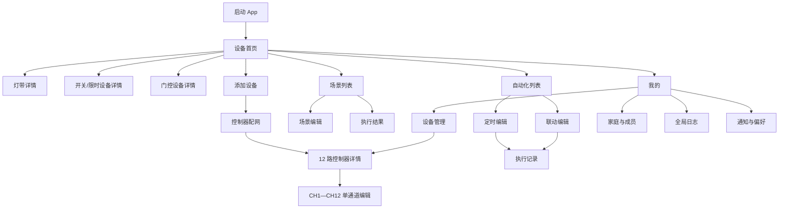
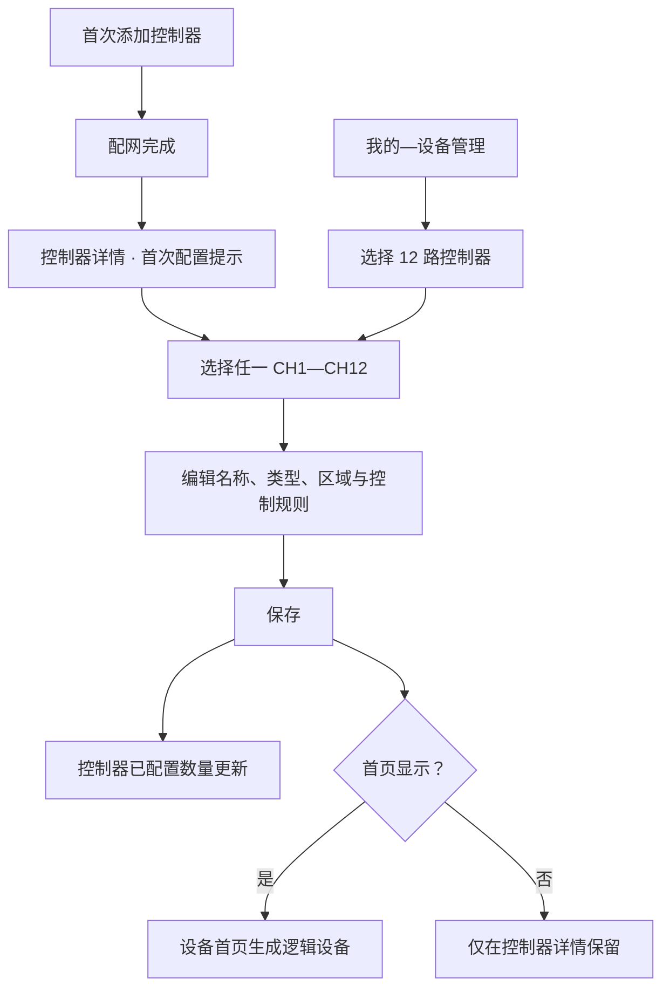
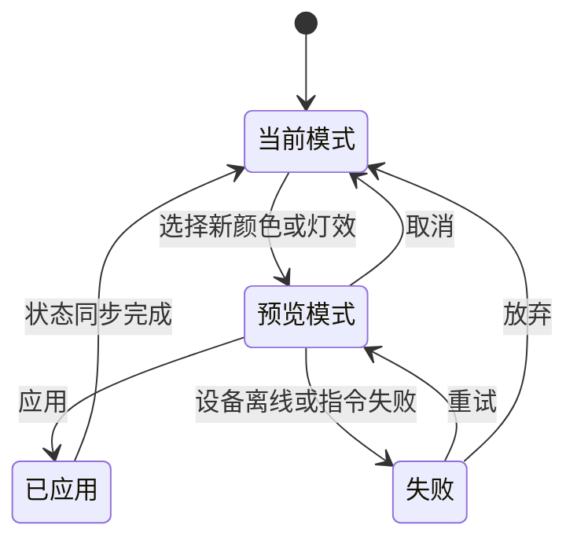
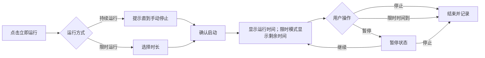
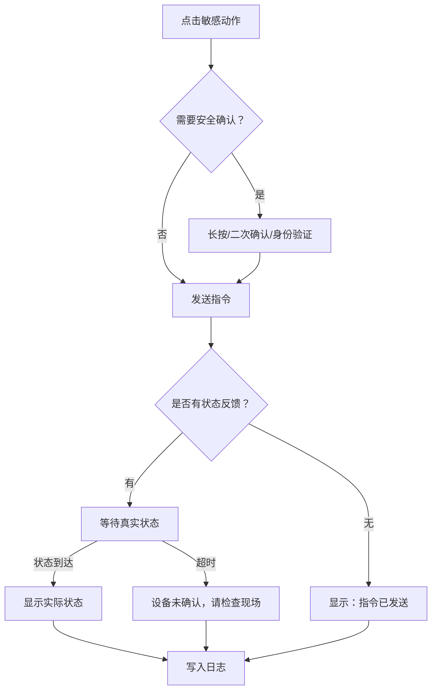
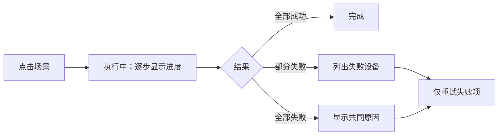
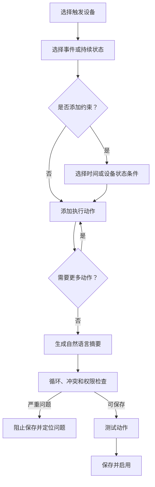

# 庭院 IoT App 低保真线框与交互说明

> 版本：v0.2  
> 目标：验证信息层级、页面内容、主流程和状态反馈。  
> 说明：本文件不定义品牌色、字体、圆角、插画和最终视觉风格。

## 1. 原型范围

本轮覆盖 12 个核心界面：

1. 设备首页。
2. 灯带详情。
3. 保持型/限时运行设备详情。
4. 门控等脉冲型设备详情。
5. 场景列表与场景编辑。
6. 自动化列表。
7. 定时编辑。
8. 联动编辑。
9. 添加设备。
10. 物理设备管理。
11. 12 路控制器详情。
12. 单通道编辑。

本轮只定义 App 侧的信息架构、配置字段与交互，不确定继电器电气参数、接线方式或固件能力。

## 2. 全局导航与页面关系

底部导航始终为：设备｜场景｜自动化｜我的。进入编辑流程和设备详情后隐藏底部导航，使用返回按钮，防止未保存内容丢失。

## 3. 控制器管理与通道配置

### 3.1 物理设备与逻辑设备

| 对象 | 展示入口 | 作用 |
|---|---|---|
| 智能灯带 | 设备首页；我的—设备管理 | 日常控制，同时作为物理设备管理 |
| 12 路控制器 | 我的—设备管理 | 联网、通道配置、维护和排障 |
| 已配置通道 | 设备首页 | 以庭院门、喷泉、灌溉、水泵等逻辑设备进行日常控制 |
| 未配置通道 | 控制器详情 | 保留 CH 编号和“未配置”状态，不出现在首页 |

### 3.2 页面与流程

### 3.3 控制器详情线框

| 顺序 | 区块 | 内容 |
|---|---|---|
| 1 | 顶部栏 | 返回、控制器名称、设置 |
| 2 | 设备摘要 | 型号、在线/连接方式、已配置/未配置/异常数量 |
| 3 | 通道列表 | 固定显示 CH1—CH12；已配置显示名称、类型、区域和模式，未配置显示配置入口 |
| 4 | 维护入口 | 网络、设备信息、重启/移除等；破坏性操作单独确认 |

首次添加进入该页时增加说明：“先配置常用通道，也可以稍后在设备管理中继续。”不要求一次完成 12 路。

### 3.4 单通道编辑线框

| 顺序 | 区块 | 内容 |
|---|---|---|
| 1 | 基础信息 | CH 编号、名称、设备类型、所属区域 |
| 2 | 控制规则 | 开关/点动脉冲、脉冲时长、常开 NO/常闭 NC |
| 3 | 使用范围 | 首页显示、允许加入场景/定时/联动 |
| 4 | 安全与提醒 | 敏感操作、运行超时提醒 |
| 5 | 固定操作 | 保存；已配置通道另有“清除配置” |

保存后返回控制器详情并刷新通道摘要。逻辑设备详情展示“控制器 · CHx”关联行，可进入通道编辑或控制器详情。清除配置前必须说明对首页设备、场景和自动化的影响。

## 4. 设备首页

### 4.1 页面区块顺序

| 顺序 | 区块 | 内容 | 主要交互 |
|---|---|---|---|
| 1 | 顶部栏 | 当前庭院、下拉切换、消息、添加设备 | 切换庭院；进入消息；添加设备 |
| 2 | 异常摘要 | 离线数、告警数、门未关闭等；正常时收起 | 点击查看受影响设备 |
| 3 | 区域筛选 | 全部、前院、后院、露台、泳池区 | 横向切换筛选 |
| 4 | 收藏设备 | 常用设备卡片 | 快捷控制或进入详情 |
| 5 | 区域设备 | 按当前筛选显示全部设备 | 快捷控制或进入详情 |
| 6 | 底部导航 | 设备、场景、自动化、我的 | 切换一级模块 |

### 4.2 设备卡片类型

| 卡片 | 主信息 | 快捷操作 | 点击主体 |
|---|---|---|---|
| 灯带 | 当前颜色/灯效、亮度、在线状态 | 开/关 | 灯带详情 |
| 水泵/喷泉 | 开关状态、已运行时间 | 开/关 | 保持型设备详情 |
| 灌溉区 | 运行状态、剩余时间 | 启动/停止 | 限时运行详情 |
| 庭院门 | 门状态或“状态未知” | 允许直接执行；沿用长按、二次确认或身份验证 | 门控详情 |
| 车库门 | 开/关/受阻/未知 | 允许直接执行；沿用安全确认规则 | 门控详情 |
| 卷帘 | 开/关/位置 | 开/停/关中的安全快捷项 | 卷帘详情 |

### 4.3 关键状态

- 无设备：解释添加后可做什么，主按钮为“添加第一个设备”。
- 全部正常：异常摘要收起为简短状态。
- 有告警：摘要固定在区域筛选之前。
- 设备离线：卡片显示最后在线时间，快捷操作不可用。
- 操作失败：卡片回到原状态并显示重试入口。
- 下拉刷新：更新设备状态，不改变当前区域筛选。

## 5. 灯带详情

### 5.1 页面结构

| 顺序 | 区块 | 内容 |
|---|---|---|
| 1 | 顶部栏 | 返回、设备名、在线/连接方式、设置 |
| 2 | 当前状态 | 当前颜色或灯效预览、开关、亮度 |
| 3 | 模式标签 | 白光、颜色、灯效、DIY、音乐；按能力显示 |
| 4 | 模式内容 | 当前模式的控制器和预设列表 |
| 5 | 快捷动作 | 临时定时、加入场景、创建定时、创建联动 |

### 5.2 模式切换行为

### 5.3 白光与颜色

- 白光：色温滑杆位于常用预设之前；设备不支持色温时仅显示亮度。
- 颜色：色轮为主控制，最近使用和收藏色位于下方。
- 连续拖动过程中本地预览，松手后发送最终值，减少指令风暴。
- 颜色数值输入是次级入口，不占据首屏主区域。

### 5.4 灯效与 DIY

- 灯效先按分类筛选，再显示预览卡片。
- 点击灯效进入预览；底部固定“取消”和“应用”。
- DIY 使用分步流程：颜色 → 动态 → 分段 → 预览 → 命名保存。
- 不支持的动态参数隐藏，不以禁用控件堆满页面。

## 6. 保持型和限时运行设备详情

### 6.1 保持型页面

| 顺序 | 区块 | 内容 |
|---|---|---|
| 1 | 顶部栏 | 返回、名称、区域、在线状态、设置 |
| 2 | 主控制 | 大型开关、当前状态、本次运行时长 |
| 3 | 临时控制 | 运行 5/15/30/60 分钟、自定义、倒计时关闭 |
| 4 | 下一计划 | 下一条定时及进入入口 |
| 5 | 关联内容 | 所属场景、联动 |
| 6 | 最近记录 | 最近操作和查看全部 |

### 6.2 限时运行流程

## 7. 门控等脉冲型设备详情

### 7.1 页面结构

| 顺序 | 区块 | 有状态反馈 | 无状态反馈 |
|---|---|---|---|
| 1 | 顶部栏 | 名称、区域、在线、设置 | 相同 |
| 2 | 状态区 | 开启/关闭/运动中/受阻/未知 | 显示“无状态反馈”说明 |
| 3 | 主动作 | 打开、关闭或触发 | 发送脉冲动作 |
| 4 | 安全确认 | 按配置长按/二次确认/身份验证 | 相同 |
| 5 | 提醒 | 长时间未关闭、夜间开启 | 仅提供“操作通知”，不提供未关闭判断 |
| 6 | 历史 | 实际状态变化与操作记录 | 仅显示指令发送记录 |

### 7.2 操作反馈流程

## 8. 场景列表与编辑

### 8.1 场景列表

| 顺序 | 区块 | 内容 | 交互 |
|---|---|---|---|
| 1 | 顶部栏 | 标题、新建 | 创建场景 |
| 2 | 收藏场景 | 常用场景卡片 | 点击立即执行 |
| 3 | 全部场景 | 名称、设备数、上次结果 | 点击执行；更多菜单进入编辑 |
| 4 | 执行浮层 | 进度、成功/失败数量 | 查看明细、取消可取消步骤 |

点击场景卡默认执行，因此编辑、复制、删除放入明确的更多菜单，避免点击歧义。

### 8.2 场景编辑

| 步骤 | 页面内容 | 完成条件 |
|---|---|---|
| 基本信息 | 名称、图标、收藏 | 名称不为空 |
| 添加对象 | 按区域选择设备或灯组 | 至少选择 1 个对象 |
| 设置动作 | 为每个对象设置开关、灯效、时长等 | 每个对象动作有效 |
| 调整顺序 | 同步步骤、顺序步骤、延迟 | 不存在空步骤 |
| 测试与保存 | 风险检查、测试、自然语言摘要 | 测试可跳过；风险确认不可跳过 |

### 8.3 执行结果

## 9. 自动化列表

### 9.1 页面结构

| 顺序 | 区块 | 内容 |
|---|---|---|
| 1 | 顶部栏 | 标题、新建、执行记录 |
| 2 | 子页切换 | 定时｜联动 |
| 3 | 规则卡片 | 名称、自然语言摘要、启用开关、上次结果 |
| 4 | 异常提示 | 冲突、设备离线、连续失败 |

新建按钮根据当前子页默认创建对应类型，同时允许在第一步切换“定时/联动”。

### 9.2 规则卡片状态

- 已启用：显示下次执行或最近触发信息。
- 已停用：保留规则，弱化显示。
- 存在风险：显示受影响设备和处理入口。
- 连续失败：突出失败原因和日志入口。
- 条件暂不可用：例如触发设备离线，说明规则仍启用但可能无法触发。

## 10. 定时编辑

### 10.1 单页分区

| 顺序 | 分区 | 字段 |
|---|---|---|
| 1 | 名称 | 自动生成建议名称，可编辑 |
| 2 | 执行时间 | 指定时间/日出/日落、偏移 |
| 3 | 重复规则 | 一次、每天、工作日、自定义星期、日期范围 |
| 4 | 执行动作 | 添加设备动作或执行场景 |
| 5 | 失败处理 | 失败通知、是否继续其他动作 |
| 6 | 摘要与测试 | 自然语言摘要、测试动作 |
| 7 | 保存 | 保存并启用/仅保存 |

页面固定提示“按庭院时区执行”。

### 10.2 创建流程

## 11. 联动编辑

### 11.1 页面骨架

联动编辑使用三张固定顺序的规则卡：

| 规则卡 | 必填 | 主要内容 |
|---|---|---|
| 当 | 是 | 触发设备、触发事件；可添加多个触发器 |
| 并且 | 否 | 时段、星期、日出日落、其他设备状态、家庭模式 |
| 就 | 是 | 一个或多个设备动作、场景、延迟、通知 |

底部固定区域依次显示：自然语言摘要 → 风险/冲突提示 → 测试动作 → 保存。

### 11.2 创建流程

### 11.3 逻辑展示

- 多个“当”之间显示“任一发生”。
- 多个“并且”之间显示“全部满足”。
- 多个“就”按步骤分组；同一步标记“同时”，步骤之间标记“然后”。
- 用户不需要接触 OR、AND 等技术表达，但详情说明可以显示对应逻辑。

### 11.4 示例

示例一：

> 当庭院门打开，并且时间为日落至 23:00，就把路径灯设为暖白 60%，5 分钟后关闭。

示例二：

> 当水泵持续运行 60 分钟，就关闭水泵，并通知所有者。

示例三：

> 当“花园晚宴”场景被执行，就启动喷泉 30 分钟。

## 12. 离开页面与草稿规则

- 新建或编辑内容发生变化后返回，弹出“保存草稿/放弃/继续编辑”。
- 场景和自动化草稿不立即生效。
- 删除场景或规则必须二次确认，并说明被其他自动化引用的影响。
- 设备被删除或权限变化时，相关规则保留但停用，并指出失效动作。

## 13. 首轮可用性评审任务

低保真评审时使用以下真实任务，不以单页好不好看作为判断标准：

1. 在首页关闭“后院喷泉”。
2. 把“露台灯带”调整为暖白 40%。
3. 应用一个动态灯效，然后取消预览并恢复原状态。
4. 让“前院灌溉”立即运行 30 分钟，中途停止。
5. 打开没有状态反馈的庭院门，判断 App 是否误导用户。
6. 创建“花园晚宴”场景：灯带应用灯效，喷泉运行 60 分钟。
7. 创建每天日落后 15 分钟打开路径灯的定时。
8. 创建“门打开且天黑时，路径灯亮 5 分钟”的联动。
9. 从部分失败的场景结果中只重试失败设备。
10. 从日志中回答“昨晚水泵为什么被打开”。
11. 从“我的—设备管理”进入控制器，把 CH5 配置为“泳池循环泵”，并确认已配置数量更新。
12. 从“庭院门”详情追溯到“控制器 · CH1”，修改通道名称后确认关联信息同步。
13. 首次添加 12 路控制器后跳过部分通道，并确认后续仍可从设备管理继续配置。

## 14. 已确认的线框决策

> 最近确认：2026-08-03

1. 一级导航确定为“设备｜场景｜自动化｜我的”。
2. 首页默认按区域筛选。
3. 场景卡片点击直接执行，编辑进入更多菜单。
4. 自动化固定分为“定时”和“联动”两个子页。
5. 门控等敏感设备允许从首页直接操作，同时执行安全确认。
6. 立即灌溉和临时运行允许持续运行，不强制选择时长。
7. 安装商使用临时成员权限，不设置独立工作台。
8. 物理控制器在“我的—设备管理”维护，已配置通道作为逻辑设备进入设备首页。
9. 控制器详情固定展示 CH1—CH12，允许首次只配置常用通道。
10. 逻辑设备详情提供控制器和通道的关联入口。

当前高保真原型已实现上述信息架构；后续视觉调整不改变物理设备与逻辑设备的对象关系。
